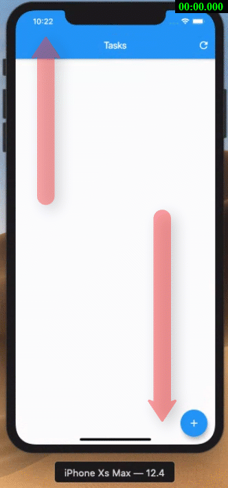

# e010_flutter_safearea_e004base

## Based On e004

- [elrashid-flutter-examples/e004_flutter_listview_crud_app_using_nonsecure_rest_api](https://github.com/elrashid-flutter-examples/e004_flutter_listview_crud_app_using_nonsecure_rest_api)

## Screen Record

## What

- SafeArea for tasks in flutter Task app (e004)

- must run with :

  - [elrashid-flutter-examples/e002-aspcore-rest-api-server-for-flutter](https://github.com/elrashid-flutter-examples/e002-aspcore-rest-api-server-for-flutter)

## Full code

    void main() {
    runApp(MyApp());
    }

    class MyApp extends StatelessWidget {
    Widget build(BuildContext context) {
        var materialApp = MaterialApp(
        debugShowCheckedModeBanner: false,
        title: 'MY APP',
        theme: ThemeData(
            primarySwatch: Colors.blue,
        ),
        home: SafeArea(
            child: TasksPageWidget(),
        ),
        );
        return materialApp;
    }
    }

## Ref

- soon
